# 🌍 Travelo - Discover Your Next Destination

<div align="center">


[](https://flutter.dev)
[](https://dart.dev)
[](LICENSE)

**A beautiful, modern travel discovery application built with Flutter**

[Features](#-features) • [Screenshots](#-screenshots) • [Installation](#-installation) • [Usage](#-usage) • [Architecture](#-architecture) • [Contributing](#-contributing)

</div>

---

## 📱 About

Travelo is a comprehensive travel discovery application that helps users explore amazing destinations around the world. With an intuitive interface and rich features, users can browse destinations, save favorites, search for places, and discover trips based on their mood.

### ✨ Key Highlights

- 🎨 **Modern UI/UX** - Clean, intuitive interface with smooth animations
- 🔍 **Smart Search** - Real-time search across destinations
- ❤️ **Favorites System** - Save and manage your favorite destinations
- 🎭 **Mood-Based Discovery** - Find destinations matching your travel mood
- 📊 **Category Filtering** - Browse by categories (Historical, Beach, Adventure, etc.)
- 🌐 **Dynamic Content** - Network images with caching support
- 🔐 **User Authentication** - Sign up, sign in, and password recovery

---

## 🎯 Features

### Core Features

#### 🏠 Home Screen
- Beautiful hero section with gradient design
- Search functionality with real-time filtering
- Category-based filtering (All, Popular, Historical, Adventure, Beach, Romantic)
- Horizontal scrollable destination cards
- Quick access buttons (Favorites, Places, Mood)
- Dynamic content updates

#### 🗺️ Destination Details
- High-quality main images
- Image gallery with horizontal scroll
- Detailed descriptions with historical/cultural information
- Rating display
- Location information
- Add/Remove from favorites with visual feedback
- Smooth navigation animations

#### ❤️ Favorites Management
- View all saved destinations
- Beautiful card layout with images
- Remove from favorites with confirmation
- Empty state with helpful message
- Real-time updates across the app

#### 🔍 Search System
- Real-time search as you type
- Search by title, location, or country
- Search results with relevant information
- No results state with icon
- Clear search functionality

#### 🎭 Mood Selection
- Choose travel mood (Relax, Adventurous, Photo Spot, Historical, Family+Kids)
- Beautiful emoji-based cards
- Grid layout for easy selection
- Recommendations based on selected mood

#### 🔐 Authentication
- **Sign Up**
  - Email validation (RegEx pattern)
  - Password validation (minimum 6 characters)
  - Confirm password matching
  - Show/Hide password toggle
  - Social login buttons (Facebook, Twitter, Google)
  
- **Sign In**
  - Email and password authentication
  - Remember me functionality
  - Social login integration
  - Forgot password link
  
- **Password Recovery**
  - Phone number verification
  - OTP verification (5-digit code)
  - Auto-focus between OTP fields
  - Success confirmation screen

---

## 📸 Screenshots

<div align="center">

### Onboarding & Authentication
| Splash Screen | Onboarding | Sign In | Sign Up |
|:---:|:---:|:---:|:---:|
| 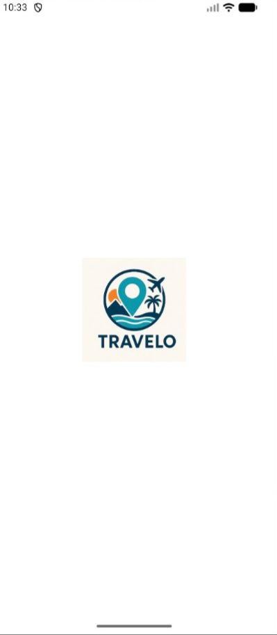 | 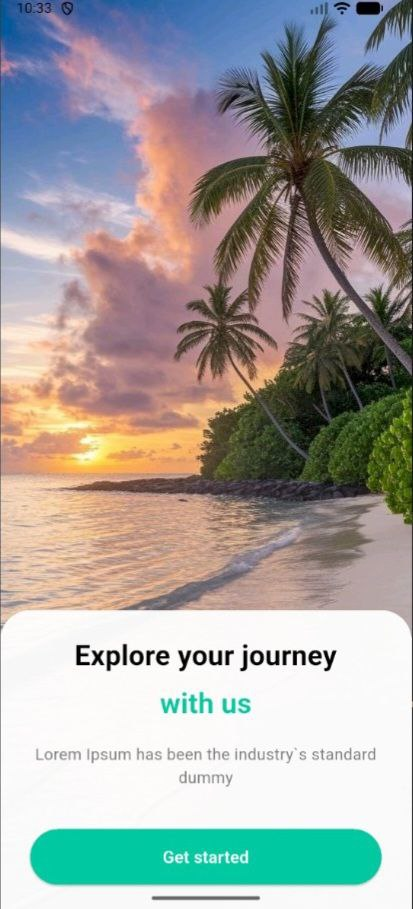 | 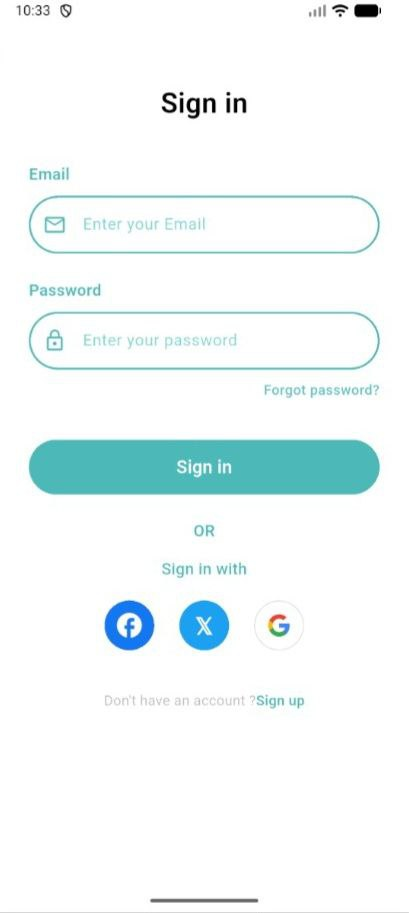 | 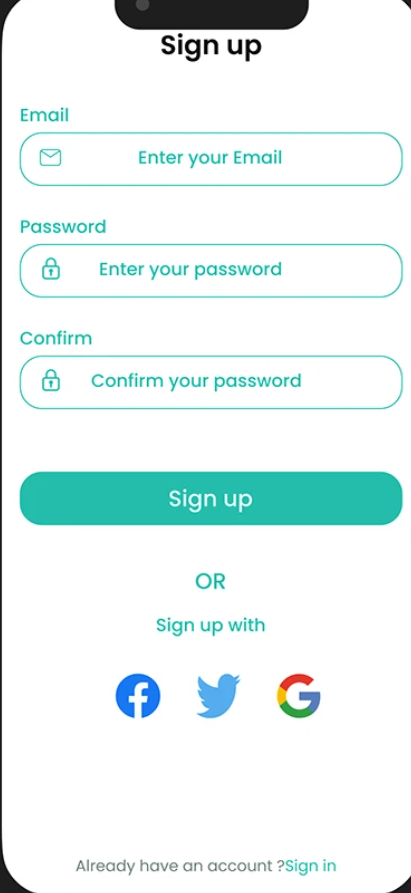 |

### Main Features
| Home Screen | Search | Destination Details | Favorites |
|:---:|:---:|:---:|:---:|
| 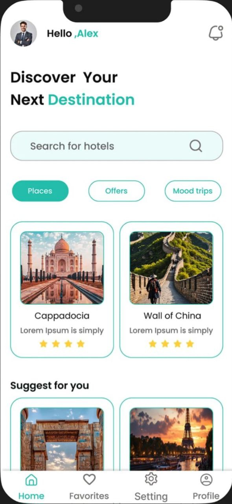 | 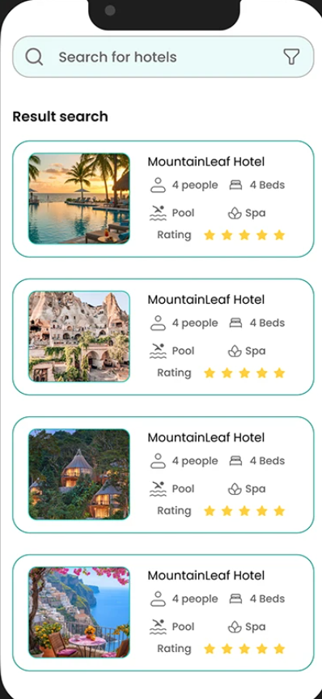 | 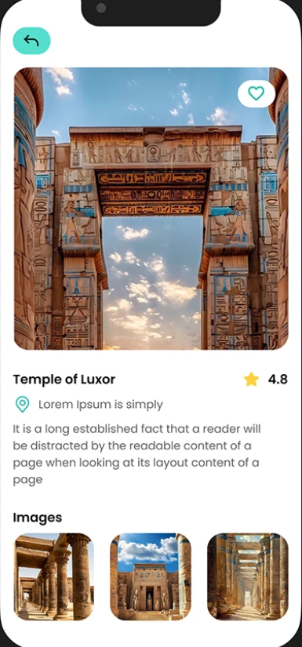 | 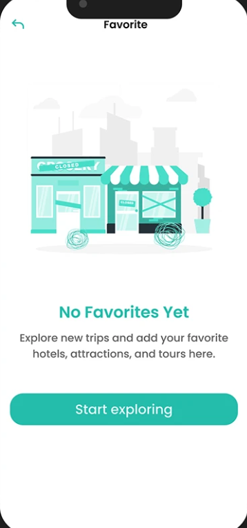 |

### Additional Features
| Mood Selection | Places List | Forgot Password | Success |
|:---:|:---:|:---:|:---:|
| 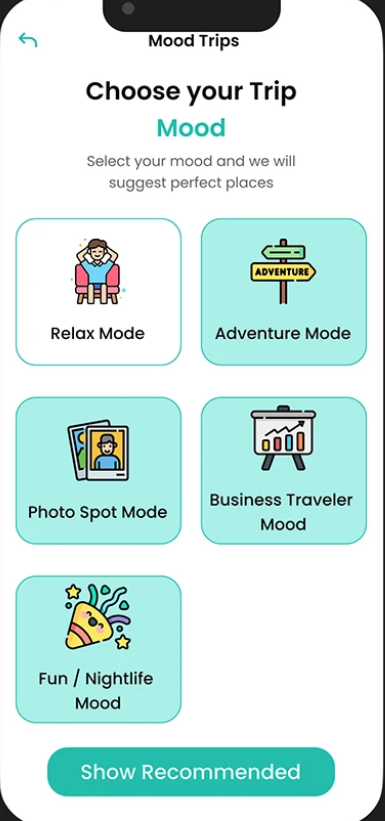 | 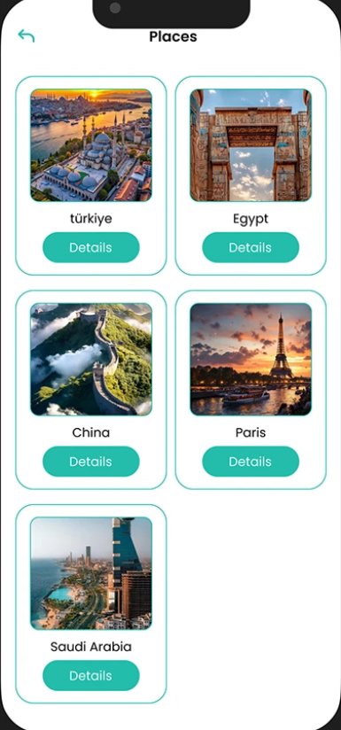 | 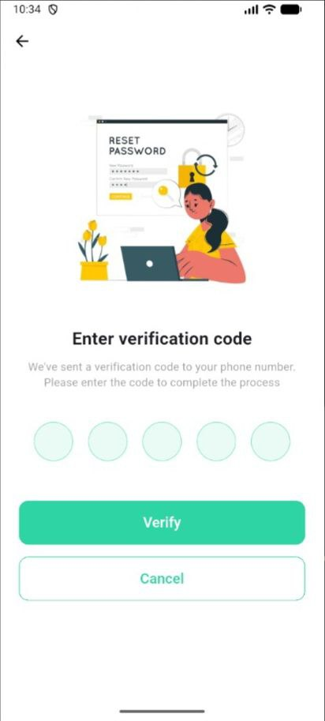 | 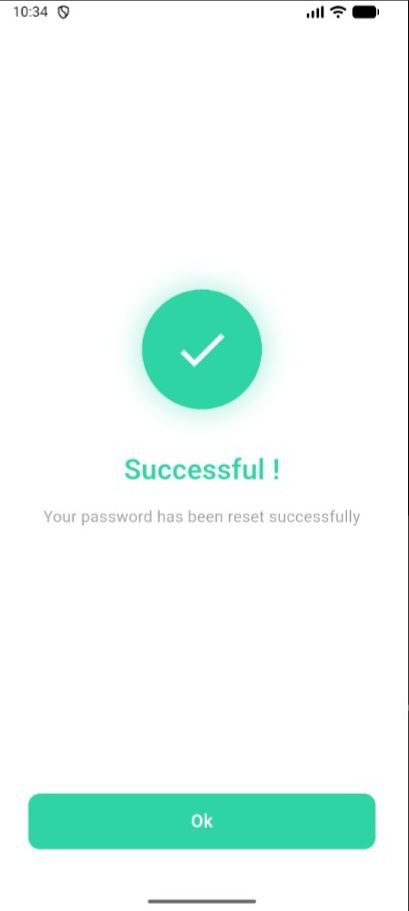 |

</div>

---

## 🚀 Installation

### Prerequisites

- **Flutter SDK**: 3.9.0 or higher
- **Dart SDK**: 3.0.0 or higher
- **IDE**: VS Code, Android Studio, or IntelliJ IDEA
- **Emulator/Device**: Android or iOS device/emulator

### Steps

1. **Clone the repository**
   ```bash
   git clone https://github.com/ahmed-khalid2004/Travelo_App.git
   cd Travelo_App/proj_v1
   ```

2. **Install dependencies**
   ```bash
   flutter pub get
   ```

3. **Add required assets**
   
   Create `Images` folder in the root and add:
   - `MainLogo.jpeg` - App logo
   - `Beach.jpeg` - Onboarding background
   - `google_logo.png` - Google sign-in icon

4. **Run the app**
   ```bash
   # Check for connected devices
   flutter devices
   
   # Run on specific device
   flutter run -d <device_id>
   
   # Or simply
   flutter run
   ```

5. **Build for production**
   ```bash
   # Android APK
   flutter build apk --release
   
   # Android App Bundle
   flutter build appbundle --release
   
   # iOS
   flutter build ios --release
   ```

---

## 📂 Project Structure

```
lib/
├── main.dart                           # App entry point & routing
├── models/
│   └── destination_model.dart          # Destination data model & sample data
├── screens/
│   ├── onboarding_screen.dart         # Welcome/Intro screen
│   ├── sign_in_page.dart              # User login
│   ├── sign_up_page.dart              # User registration
│   ├── forget_password_page.dart      # Password recovery
│   ├── verification_page.dart         # OTP verification
│   ├── success_screen.dart            # Success confirmation
│   ├── home_page.dart                 # Main dashboard
│   ├── destination_detail_screen.dart # Destination details
│   ├── favorites_screen.dart          # Saved destinations
│   ├── mood_selection_screen.dart     # Mood-based discovery
│   └── places_list_screen.dart        # Places listing
├── services/
│   └── user_preferences.dart          # State management & user data
└── widgets/
    └── reusable_widgets.dart          # Reusable UI components

assets/
└── Images/
    ├── MainLogo.jpeg
    ├── Beach.jpeg
    └── google_logo.png
```

---

## 🏗️ Architecture

### Design Pattern: **MVC + Singleton**

#### **Model**
```dart
class Destination {
  final String id;
  final String title;
  final String location;
  final String country;
  final double rating;
  final String mainImage;
  final List<String> galleryImages;
  final String description;
  final List<String> categories;
  bool isFavorite;
}
```

#### **View (Screens)**
- Stateless/Stateful Widgets
- Material Design components
- Responsive layouts

#### **Controller (Services)**
```dart
class UserPreferences extends ChangeNotifier {
  // Singleton pattern for global state
  static final UserPreferences _instance = UserPreferences._internal();
  factory UserPreferences() => _instance;
  
  // State management
  final Set<String> _favoriteIds = {};
  void toggleFavorite(String id) {
    // ... logic
    notifyListeners(); // Update UI
  }
}
```

### State Management

- **Local State**: `setState()` for UI updates
- **Global State**: `ChangeNotifier` pattern (UserPreferences)
- **Singleton Pattern**: Single instance for shared data

### Key Concepts Implemented

✅ **Widget Composition** - Reusable components  
✅ **Navigation** - Named routes & MaterialPageRoute  
✅ **Form Validation** - RegEx & custom validators  
✅ **List Performance** - ListView.builder with lazy loading  
✅ **Error Handling** - Try-catch blocks  
✅ **Memory Management** - Controllers disposal  
✅ **Network Images** - Dynamic content loading  
✅ **Type Safety** - Models instead of Maps  
✅ **Null Safety** - Dart 3.0 null safety features

---

## 🎨 Design System

### Color Palette

```dart
Primary Color:    #4DD5C5 (Turquoise)
Secondary Color:  #2DD4A3 (Mint Green)
Background:       #F5F8FA (Light Gray)
Text Primary:     #000000 (Black)
Text Secondary:   #808080 (Gray)
Error:            #FF0000 (Red)
Success:          #4DD5C5 (Turquoise)
```

### Typography

```dart
Heading:     28px, Bold
Title:       24px, Bold
Subtitle:    20px, SemiBold
Body:        16px, Regular
Caption:     14px, Regular
Small:       12px, Regular
```

### Components

- **Cards**: Rounded corners (16px), subtle shadows
- **Buttons**: Rounded (25px), elevation-free
- **Input Fields**: Custom borders, icon integration
- **Images**: NetworkImage with loading/error states

---

## 🔧 Configuration

### pubspec.yaml

```yaml
name: proj_v1
description: "A travel discovery Flutter application"
publish_to: 'none'
version: 1.0.0+1

environment:
  sdk: ^3.9.0

dependencies:
  flutter:
    sdk: flutter
  cupertino_icons: ^1.0.8

dev_dependencies:
  flutter_test:
    sdk: flutter
  flutter_lints: ^6.0.0

flutter:
  uses-material-design: true
  assets:
    - Images/MainLogo.jpeg
    - Images/Beach.jpeg
    - Images/google_logo.png
```

### Recommended Packages (Optional Enhancements)

```yaml
dependencies:
  cached_network_image: ^3.3.0    # Image caching
  shared_preferences: ^2.2.2      # Data persistence
  provider: ^6.1.1                # Advanced state management
  http: ^1.1.0                    # API integration
  intl: ^0.18.1                   # Internationalization
```

---

## 💻 Usage

### Adding a New Destination

```dart
// In destination_model.dart
Destination(
  id: '13',
  title: 'Colosseum',
  location: 'Rome',
  country: 'Italy',
  rating: 4.9,
  mainImage: 'https://images.unsplash.com/photo-xxx',
  galleryImages: ['url1', 'url2', 'url3'],
  description: 'An ancient amphitheater...',
  categories: ['Historical', 'Ancient', 'Popular'],
),
```

### Managing Favorites

```dart
// Toggle favorite
final userPrefs = UserPreferences();
userPrefs.toggleFavorite(destinationId);

// Check if favorite
bool isFav = userPrefs.isFavorite(destinationId);

// Get all favorites
List<Destination> favorites = allDestinations
  .where((dest) => userPrefs.isFavorite(dest.id))
  .toList();
```

### Navigation Examples

```dart
// Named route
Navigator.pushNamed(context, '/home');

// With data
Navigator.push(
  context,
  MaterialPageRoute(
    builder: (context) => DestinationDetailScreen(
      id: destination.id,
      title: destination.title,
      // ... other parameters
    ),
  ),
);

// Replace current screen
Navigator.pushReplacementNamed(context, '/signin');
```

---

## 🧪 Testing

### Run Tests

```bash
# All tests
flutter test

# Specific test file
flutter test test/widget_test.dart

# With coverage
flutter test --coverage
```

### Test Structure (Example)

```dart
import 'package:flutter_test/flutter_test.dart';
import 'package:proj_v1/services/user_preferences.dart';

void main() {
  group('UserPreferences Tests', () {
    test('Toggle favorite adds and removes correctly', () {
      final prefs = UserPreferences();
      const destinationId = '1';
      
      prefs.toggleFavorite(destinationId);
      expect(prefs.isFavorite(destinationId), true);
      
      prefs.toggleFavorite(destinationId);
      expect(prefs.isFavorite(destinationId), false);
    });
  });
}
```

---

## 🐛 Known Issues & Limitations

1. **Data Persistence**: Currently, user data and favorites don't persist after app restart. Implement `shared_preferences` for persistence.

2. **Authentication**: Sign up/sign in don't validate against a backend. Integrate with Firebase or a REST API for production.

3. **Social Login**: Social login buttons are UI-only. Implement Firebase Auth or OAuth for actual functionality.

4. **Network Error Handling**: Basic error states for images. Could be enhanced with retry mechanisms.

5. **Offline Support**: No offline mode currently. Consider adding local database (SQLite/Hive) for offline access.

---

## 🚀 Future Enhancements

### Planned Features

- [ ] **Backend Integration**
  - REST API integration
  - Firebase/Supabase setup
  - Real authentication

- [ ] **Data Persistence**
  - SharedPreferences for settings
  - Local database (Hive/SQLite)
  - Offline mode

- [ ] **Enhanced Features**
  - User profiles with avatars
  - Reviews and ratings system
  - Booking integration
  - Map integration (Google Maps)
  - Weather information
  - Currency converter

- [ ] **Social Features**
  - Share destinations
  - Social media integration
  - User communities
  - Trip planning

- [ ] **Improvements**
  - Dark mode
  - Multi-language support
  - Advanced search filters
  - Notifications
  - Performance optimization

---

## 🤝 Contributing

Contributions are welcome! Please follow these steps:

1. **Fork the repository**

2. **Create a feature branch**
   ```bash
   git checkout -b feature/AmazingFeature
   ```

3. **Commit your changes**
   ```bash
   git commit -m 'Add some AmazingFeature'
   ```

4. **Push to the branch**
   ```bash
   git push origin feature/AmazingFeature
   ```

5. **Open a Pull Request**

### Contribution Guidelines

- Follow Flutter/Dart style guidelines
- Write meaningful commit messages
- Add comments for complex logic
- Update documentation if needed
- Test your changes thoroughly

---

## 📄 License

This project is licensed under the MIT License - see the [LICENSE](LICENSE) file for details.

```
MIT License

Copyright (c) 2024 Ahmed Khalid

Permission is hereby granted, free of charge, to any person obtaining a copy
of this software and associated documentation files (the "Software"), to deal
in the Software without restriction, including without limitation the rights
to use, copy, modify, merge, publish, distribute, sublicense, and/or sell
copies of the Software, and to permit persons to whom the Software is
furnished to do so, subject to the following conditions:

The above copyright notice and this permission notice shall be included in all
copies or substantial portions of the Software.

THE SOFTWARE IS PROVIDED "AS IS", WITHOUT WARRANTY OF ANY KIND, EXPRESS OR
IMPLIED, INCLUDING BUT NOT LIMITED TO THE WARRANTIES OF MERCHANTABILITY,
FITNESS FOR A PARTICULAR PURPOSE AND NONINFRINGEMENT. IN NO EVENT SHALL THE
AUTHORS OR COPYRIGHT HOLDERS BE LIABLE FOR ANY CLAIM, DAMAGES OR OTHER
LIABILITY, WHETHER IN AN ACTION OF CONTRACT, TORT OR OTHERWISE, ARISING FROM,
OUT OF OR IN CONNECTION WITH THE SOFTWARE OR THE USE OR OTHER DEALINGS IN THE
SOFTWARE.
```

---

## 👨‍💻 Developer

**Ahmed Khalid**

- GitHub: [@ahmed-khalid2004](https://github.com/ahmed-khalid2004)
- LinkedIn: [Ahmed Khaled](https://www.linkedin.com/in/ahmed-k-5b6349259)
- Email: engahmedkhalid3s@gmail.com

---

## 🙏 Acknowledgments

- **Flutter Team** - Amazing framework
- **Unsplash** - Beautiful destination images
- **Material Design** - Design guidelines
- **Stack Overflow** - Problem-solving community
- **Flutter Community** - Packages and support

---

## 📊 Project Stats


---

## 📞 Support

If you have any questions or need help, please:

1. Check the [Issues](https://github.com/ahmed-khalid2004/Travelo_App/issues) page
2. Create a new issue if your problem isn't listed
3. Contact me via email

---

<div align="center">

**⭐ Star this repo if you like it!**

Made with ❤️ and Flutter

[Back to Top](#-travelo---discover-your-next-destination)

</div>
